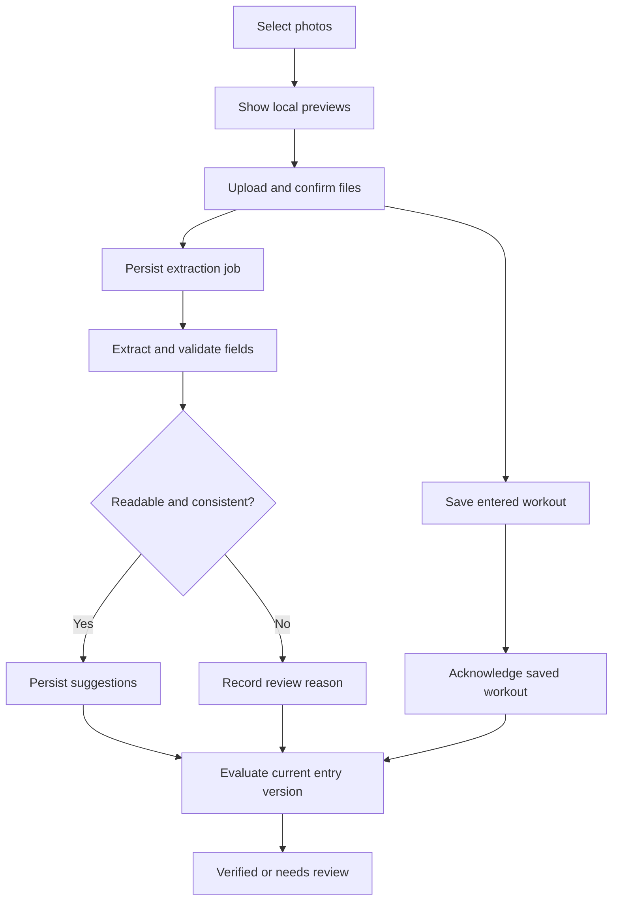

# Rowbook season-readiness audit and UX improvement plan

Prepared 2026-09-11. Repository: **JJCAPPE/rowbook**. Code baseline: [`6d2c304b0259ab3f17680471fd08d1d0c7f4d397`](https://github.com/JJCAPPE/rowbook/commit/6d2c304b0259ab3f17680471fd08d1d0c7f4d397).

The objective is to make frequent tasks fast, recoverable, inexpensive, and clear throughout a full rowing season. Prioritize **adding a workout with photos** and **reviewing workouts that could not be automatically checked**. Retain the existing visual identity; improve layouts, interaction feedback, and wording where they interfere with use.

This document contains an initial source-code inspection and an executable brief for an AI coding assistant with sub-agents. It is **not a completed browser audit or a claim that production performance has been measured**. The requested deliverable at this stage is an audit and a concrete implementation plan.

## 1. Starting evidence and limits

### Confirmed context

- The application is a TypeScript npm workspace. The product lives in `apps/web`; `packages/shared` contains schemas, statuses, validation utilities, and time rules.
- The inspected manifest uses Next.js 14 / React 18, tRPC 10, TanStack Query 4, HeroUI/Tailwind, Prisma 5, Supabase Auth/Storage/Postgres, and Gemini image extraction. Treat manifest ranges separately from versions resolved by `package-lock.json`. [E01]
- There are **12 user-facing page routes**, three cron endpoints, and the tRPC endpoint. All page routes are represented in the interaction inventory below. The repository also has a separate root `src/app`; verify Vercel's actual project root and build command before assuming which application is deployed.
- GitHub reports a successful Vercel status for the baseline commit. This establishes a historical deployment check, not current health or the SHA currently serving production.
- Supabase project discovery returned **one inactive project**. Its relationship to Rowbook could not be established. A read-only public-schema listing timed out. The active Rowbook database, Storage configuration, deployed migrations, job backlog, logs, and costs therefore remain **unverified**. Do not infer that Rowbook itself is paused.
- No authenticated browser session, real-device run, build, or executable test was performed during this planning pass. No production data or configuration was changed.
- No `AGENTS.md` or GitHub Actions workflow appears in the inspected tree. The existing implementation documents describe planned behavior and must be checked against code and deployment.

### Source findings to reproduce first

“Confirmed in code” establishes the mechanism; its production frequency and latency still require measurement.

| ID | Finding and evidence | User impact / audit action |
| --- | --- | --- |
| F01 | `handleFileSelect` uploads files serially, waits for extraction on the first file of each selection, and only then publishes the accumulated IDs and previews after the loop. [E02] | A selected photo may remain invisible throughout the slowest stage. Measure selection → preview, upload, confirmation, extraction, and remaining-file delays separately. |
| F02 | Extraction/save percentages are simulated up to 90%; both paths add 400 ms delays. Multi-file upload progress is not updated like single-file progress. The XHR has no timeout or usable cancel handle. [E02] | Progress can appear stuck or misleading. Replace with real upload bytes and named server states; add per-file timeout, retry, and cancellation. |
| F03 | Camera/picker accept `image/*`, but the backend permits JPEG/PNG/WebP only, up to 10 MiB. No normalization/compression step appears in the upload flow. [E02], [E03] | Test actual iPhone Photos/camera formats, including HEIC, orientation, and large images. Do not assume every iPhone returns HEIC or that renaming a file converts it. |
| F04 | Upload confirmation creates a job, while `extractFromProof` separately calls Gemini without persisting/reusing that result. The worker extracts individual images and can make a combined call for each job in a multi-image entry. [E04], [E05] | The code permits repeated paid work. Trace call counts by evidence set; separate calls actually made from calls that would occur if the queue runs. |
| F05 | The extraction cron route processes one job per invocation, but `vercel.json` schedules only weekly aggregation and cleanup. Claiming jobs selects only unlocked `NOT_CHECKED` rows; there is no retry schedule or stale `PROCESSING` lease recovery. [E05], [E06] | A stored job can remain unchecked or stuck. Determine whether any external scheduler exists before concluding the production queue has no consumer. |
| F06 | Confirmation trusts the client completion signal, writes `uploadedAt`, then creates a unique job in separate operations. Entry creation connects proofs without checking whether they are already attached to another entry. [E04], [E07] | Retried confirmation can fail; false confirmations and reused proof IDs can create inconsistent state. Test idempotency, object existence, proof ownership/attachment, and failure between writes. |
| F07 | Single-image entry creation evaluates `proofOcr.extractedFields` supplied by the browser. The form also overwrites edited fields with extraction results and does not clear `firstExtractedFields` on successful reset. [E02], [E07], [E08] | Server verification must use persisted server results. Reproduce stale extraction on the next workout, late responses, overlapping file selections, and manual-edit overwrites. |
| F08 | The active validator checks date and summed minutes using a one-sided `total >= entered - 1` condition. It ignores distance/HR, can sum duplicate screenshots, and maps incomplete extraction to pending. The README specifies stricter matching, distance truncation, and submission-time week assignment; entry creation instead derives the week from workout date. [E08], [E09] | Resolve these product-rule conflicts explicitly. Do not optimize by silently accepting different workouts or changing credited minutes. |
| F09 | `getReviewQueue` computes the requested week but does not pass a date/week filter to its repository. It includes reviewed candidates and eagerly signs proof URLs for all returned entries. The UI filters some entries only after loading. [E10] | The selected week can be misleading, and workload grows with the season. Filter/paginate on the server; separate pending and completed review views. |
| F10 | Review actions already remove rows from cache **after success** and track per-row loading. However, mutation errors are swallowed, rejection uses `window.prompt`, and blank reasons/arbitrary validation enum values are allowed by the endpoint. [E10], [E11] | Preserve the useful cache update, add immediate pending feedback and visible retry, and constrain review decisions/reasons on the server. |
| F11 | Athlete dashboard/history and coach detail eagerly attach signed URLs; each signing helper also fetches proof metadata. Dashboard does not render the returned proof URLs. Coach detail loads all entries; history-with-entries defaults to eight weeks. [E12] | Avoid signing unused/expired images; load metadata first and images on demand. Support complete season history through bounded pagination. |
| F12 | Dashboard/leaderboard/overview requests repeat entry/target/trend reads. Missing aggregates can cause writes during leaderboard reads. The coach layout fetches a full overview just to choose an athlete navigation target. Save/edit/delete often wait for broad invalidations. [E13] | Measure SQL/request count, payload, and auth overhead. Narrow data contracts and invalidations; remove incidental full-team work from common actions. |
| F13 | Review/entry/audit/aggregate writes occur in several separate steps, and worker checks for manual review are not one atomic entry-wide condition. Settings can remove one target type before a later call creates its replacement. [E05], [E07], [E11], [E14] | Exercise partial failures and concurrent coach/worker edits. A returned error must not conceal a committed workout or partially changed target. |
| F14 | Login uses Google OAuth, while the linked reset-password page has no submission handler. Proof viewer uses a custom portal with rotation/carousel/download but no explicit dialog semantics, Escape handling, focus containment, or zoom. Several shell week controls apply to pages that do not consume their query parameter. [E15] | Include authentication, misleading controls, keyboard access, mobile image inspection, and empty/error states in the audit. |
| F15 | Gemini model ID is hardcoded to `gemini-3-flash-preview`; parsing is a TypeScript cast after `JSON.parse`, without application runtime validation or explicit request deadline. Diagnostics include raw extraction and provider error details. [E16] | Verify the account/model request with sanitized diagnostics; add supported SDK/model configuration, schema validation, bounded timeouts, usage accounting, and safe error messages. This is not proof that the model is unavailable. |
| F16 | Weekly jobs rebuild multiple weeks, gate email on a New York hour window, and lack a persisted send-once record. Cleanup processes expired objects serially; download/signing do not explicitly reject deleted records. Test scripts mention integration/E2E directories absent from the tree. [E17] | Audit cutoff/DST, duplicate and missed schedules, retention, and actual test coverage before season readiness is claimed. |

## 2. Instructions for the lead AI assistant

Use this section as the launch brief for the audit.

> Audit Rowbook at the current repository head and its verified deployed environment. Read this entire plan, repository instructions, schemas, and existing implementation documents. Revalidate the source findings against the current SHA. Spawn the bounded sub-agents described below. Produce an exhaustive interaction inventory, measured baseline, root-cause findings, extraction benchmark, and ordered implementation backlog with acceptance tests and rollback steps.
>
> Prioritize workout uploads/extraction and coach review. Preserve Supabase Postgres, Prisma, Vercel, the established visual identity, and existing season data. Recommend the smallest changes that meet the measured requirements. Separate observations, hypotheses, proposed targets, and blocked checks. Do not substitute animations for reduced waiting or reliability.
>
> This assignment is the audit and plan. Use isolated test data for failures, mutations, and load experiments; inspect production read-only. Continue all independent work when an integration is unavailable, and record precisely what evidence is missing. Finish with concrete, reviewable proposed changes rather than a generic list of best practices.

### Delegated work

The lead owns shared contracts, the integrated report, cross-flow consistency, and prioritization. Start with up to **four concurrent sub-agents**; rotate the remaining tasks as slots free up. Each sub-agent has a bounded deliverable. Avoid simultaneous edits to shared code or schema.

| Agent | Assignment and starting files | Required output |
| --- | --- | --- |
| A — Interaction and device audit | All `apps/web/src/app` pages, forms, shell, viewer, and shared UI. Enumerate every actionable control and test role/state/device combinations. Prioritize upload and review task completion. | `audit/interactions.md`, device screenshots/trace references, wording changes, and task-step counts. |
| B — Upload and extraction reliability | Upload form, proof router/service/storage, extraction service/jobs/repository, shared proof schemas. Trace one photo, multiple photos, partial upload, and entry/job races. | `audit/upload-extraction.md`: timelines, call counts, failure reproductions, proposed state/API contracts, and comparison of extraction options. |
| C — Supabase and server performance | Verify project identity; inspect live schema/migrations, storage policies, job state, Prisma queries, aggregations, auth, and services. Use bounded metadata/aggregate queries first. | `audit/backend.md`: query counts/plans, project/deployment mapping, index/transaction candidates, and blocked live checks. |
| D — Coach review and data correctness | Review page, coach/validation services, target settings, shared validation/week rules. Test simultaneous reviewers, worker completion after review, and totals propagation. | `audit/review-correctness.md`: rule-decision table, review flow, concurrency contract, and invariant tests. |
| E — Operations and cost | Vercel root/runtime/region/schedules, provider availability, job dispatch, retention, weekly email, logging, and actual bills/quotas where available. | `audit/operations-cost.md`: practical worker choice, monthly/season model, alert/runbook design, and rollout sequence. |
| F — Independent verification | Review A–E evidence; reproduce highest-impact findings; test acceptance scenarios on the integrated candidate when implementation is separately assigned. | `audit/verification.md`: verified results, contradictions, sample sizes, open blockers, and release recommendation. |

Each report must state the code SHA, environment, fixture IDs, exact reproduction, expected/actual behavior, measurements with sample size, confidence, responsible files, proposed change, effort range, and dependency. Never label an unexecuted check “passed.”

The lead first merges findings, resolves contradictory conclusions, and chooses the upload/review contracts. Only then should implementation tasks be split by file ownership. A supported sequential execution of these assignments is acceptable if sub-agents are unavailable.

## 3. Exhaustive interaction inventory

This is the required starting inventory, not a substitute for walking the UI. The lead must reconcile it against every page, rendered link/button/form, keyboard handler, mutation, and navigation path at the current SHA. Add one row per newly found control and map every procedure to a UI action or an explicitly backend-only capability.

For **each row**, record: role; preconditions; click/key sequence; visible response; network/SQL work; empty/loading/success/error states; retry/cancel/back/refresh behavior; saved-state correctness; accessibility; mobile/desktop evidence; and p50/p95 where applicable.

| ID | Surface and controls to exercise | Specific checks / intended improvement |
| --- | --- | --- |
| I01 | `/`: landing, Log in, logo/home return | Correct authenticated/unauthenticated destination; no redirect loop or layout flash. |
| I02 | `/login`: Google sign-in, cancellation, provider error, repeat tap | Visible response; correct callback; blocked/unapproved/inactive accounts receive useful access guidance. |
| I03 | `/auth/callback`: missing/expired code, role routing, return from provider | Cookies survive redirect; session refresh/reload works on Safari; no sensitive error leakage. |
| I04 | `/reset-password`: email entry, Send reset link, Back to login | Currently unwired. Either implement a real supported recovery flow or replace the misleading OAuth-incompatible route/link with account access help. |
| I05 | Athlete/coach shell: sidebar, bottom navigation, logo, browser back/forward, deep links | Active state, scroll restoration, fast route changes, no lost draft, sticky controls clear the keyboard and safe area. |
| I06 | Shell week selector across **all** pages | Selected week matches displayed data; hide/disable on pages where it has no meaning. Reach older season weeks beyond the current six options. |
| I07 | User menu: open, outside click, Escape, logout | Keyboard focus, touch behavior, failed logout feedback, private caches cleared and access removed. |
| I08 | `/athlete`: totals, progress, recent entries, history link, Log workout | Useful data before charts; accurate pending/rejected/exempt totals; clear no-workout and no-goal states. |
| I09 | `/athlete/log`: activity, date, minutes, distance, average HR, notes | Mobile numeric keyboards, visible units, optional fields, sensible defaults, local validation, future/locked-date messages. |
| I10 | Log: Take photo / Upload screenshot; cancel/reopen picker; select same file again | Real iPhone camera/Photos and Android paths; JPEG/PNG/WebP/HEIC, rotation, empty MIME, large/corrupt files. Immediate local preview. |
| I11 | Log: multiple images, add another batch, partial success, remove/replace/reorder | Per-file state; preserve successful uploads; explicit group is one workout; stop overlapping selections corrupting IDs. Missing controls are findings. |
| I12 | Log: upload progress, timeout, cancel, retry, URL expiry, connection change | Accurate bytes and actionable error; retry only failed files; never mark missing objects uploaded. |
| I13 | Log: extraction suggestions, manual edits during processing, incomplete/failed extraction | No overwritten user edits; visible suggestions/provenance; manual entry remains possible; extraction can finish after save. |
| I14 | Log: submit, double tap, lost response, navigation during save, log next workout | One durable entry per intent; status reflects server acknowledgment; reset all prior extraction state; no abandoned-photo loss. |
| I15 | Dashboard/history edit modal: open, alter fields, save, cancel, Escape | Immediate row feedback, retained edits after error, correct revalidation and totals; locked weeks explain why editing is unavailable. |
| I16 | Dashboard/history delete dialog: open, cancel, confirm, retry | Correct item; visible failure; independent rows remain usable; deleting linked proofs/legacy relations preserves integrity. |
| I17 | Dashboard/history extraction details and rejection reason | Plain-language reason and next action; optional missing HR is not presented as a failed required field. |
| I18 | `/athlete/history`: All/Erg/Run/HR present/Min 30 filters, View week, scrolling | Clarify session vs weekly filters; inspect all supported activities; bounded requests and access to the entire season. |
| I19 | `/athlete/week/[weekStart]`: totals, entries, proofs, week switching | Invalid/old/empty weeks; date and cutoff consistency; data retained after photo expiry. |
| I20 | `/athlete/leaderboard`: week and filters, trends, rank/status | Correct filter combinations, ties and exemptions; responsive readable values; no access to teammates' private proofs. |
| I21 | `/coach`: selected week, summary badges, filters, charts, athlete navigation | Summary and list agree; distinguish informational badges from links; direct route to relevant review work where useful. |
| I22 | `/coach/athlete/[id]`: athlete switch, history, entries and proofs | Fast switch without full-team/full-history overhead; wrong/missing ID; bounded season history; current week control reflects actual behavior. |
| I23 | `/coach/review`: initial queue, selected week, Show reviewed, empty/error/reload | Current code needs server filtering. Separate queued/processing, needs-review, and completed decisions; exact counts and stable ordering. |
| I24 | Review: open evidence, inspect multiple images, compare entered/extracted values | Make disagreement visible beside evidence; preserve position; prefetch only the next likely item. |
| I25 | Review: approve, reject, cancel rejection, required reason, retry, next item | Immediate per-item pending feedback; no silent failure; do not lose a row on failure; server validates final decision. |
| I26 | Review: another coach acts, worker finishes, athlete edits, refresh mid-action | Version conflict handled visibly; manual decision wins over stale worker output; correct audit trail and totals. |
| I27 | Shared proof viewer: open/close, carousel arrows/pages, keyboard, rotate, download | Dialog semantics, focus return, Escape, zoom/pan, portrait/landscape, signed-URL renewal, deleted/unavailable image states. |
| I28 | `/coach/settings`: six-week team goals, edit values, Save Changes | Validate integers/ranges; retain drafts on refresh/failure; avoid partially applied batches; correct DST week keys. |
| I29 | Settings: athlete search, Exempt/Weekly exempt/Custom minutes filters | Clear filter meaning, no hidden unsaved changes, readable phone layout, bounded roster work. |
| I30 | Settings: custom target, weekly/indefinite exemption, reason, reset/remove, row Save | One atomic target change; row-level pending/error; current-week restrictions and indefinite precedence remain consistent everywhere. |
| I31 | Reporting: `reporting.exportCsv` and `getTeamTrends` | Backend capabilities exist; no export control was found in inspected pages. Record reachability instead of pretending it is a tested user flow; verify scope, totals, CSV escaping, and download if exposed. |
| I32 | Weekly cutoff/recap and proof expiry experienced by users | Sunday 20:00 America/New_York; browser open over cutoff; delayed jobs/email; expired proof remains understandable in history/review. |
| I33 | All flows: offline/reconnect, session expiry, refresh, duplicate tabs, long names/text | Persist supported drafts, give explicit unsaved state, recover authentication, preserve navigation and prevent duplicate mutations. |

## 4. Measurement before redesign

### Reproducible baseline

1. Identify deployed SHA, Vercel project root, Node/runtime limits, hosting plan, function/database/storage regions, and the **matching** Supabase project. Compare non-secret host/project identifiers across browser Auth, server Auth/Storage, and Prisma connection settings. Never paste keys or database URLs with credentials into reports.
2. Create synthetic athlete/coach/admin and inactive-account fixtures in an isolated environment. Use a **32-week** dataset at the expected roster size, then 5× that size; include two teams for permission tests. Until real volumes are known, use 60 athletes × 6 workouts/week = **11,520 workouts**, with one to three images.
3. Walk all I01–I33 flows with both cold and warm data. Capture useful-content timing, request waterfall, React long tasks, API timing, Prisma query count/time, payload bytes, image bytes, and action completion. Capture failure states, not just the successful screenshot.
4. Run at least 20 repetitions for common flow timing; include sample counts and distribution. Small-sample p95 is provisional. Separate provider latency, queue delay, upload time, server commit, and client rendering.
5. Measure a burst of one upload per athlete within two minutes and a sustained hour at 2× observed peak. Use stubbed provider responses for load; use separately capped live calls for model benchmarking.
6. Link anonymized traces/screenshots to interaction IDs. Record any unavailable browser/device/environment explicitly.

### Proposed acceptance budgets

These are starting engineering targets, **not measured current results or promises**. Revisit only with documented device/network evidence.

| Metric | Proposed target and measurement boundary |
| --- | --- |
| Visible click/input feedback | p95 ≤100 ms from interaction to pending/selected/pressed state; keep typing responsive during processing. |
| Photo selection feedback | Preview container and file state within 100 ms; decoded local preview p95 ≤500 ms for supported fixtures. |
| Durable save / review decision | p95 ≤1 s warm, ≤2 s cold from request dispatch to acknowledged DB commit, excluding image transfer and AI. Failures retain recoverable state. |
| Upload | p95 ≤10 s for a normalized 1 MiB image on the defined mobile profile; report larger-file results separately. |
| Queue start and extraction | Normal-load queue wait p95 ≤5 s; uploaded evidence → usable result p50 ≤5 s / p95 ≤20 s. Saving and manual editing remain available throughout. |
| Recovery | Every accepted job reaches a recorded terminal result or explicit manual-review state; no lease remains abandoned. Retry exhaustion/manual fallback within 5 minutes under injected transient faults. |
| Review workflow | Next item usable ≤300 ms when prefetched; p50 ≤15 s per straightforward decision and ≥50% improvement in a fixed 20-item task vs baseline. |
| Dashboard/list/week change | Useful primary content p95 ≤1.5 s warm / ≤2.5 s cold on the mobile profile. No full-season image signing in initial responses. |
| Updates elsewhere | Counts/totals reflect acknowledged mutations within 2 s in active views; reconnect/refocus reconciles stale data. |
| Reliability | ≥99.5% eligible upload/save success in pilot; 100% recovery and no duplicate entries/decisions in injected-failure tests. User cancellation/invalid files are separate categories. |
| Extraction quality | Target ≥95% required-field correctness on readable holdout proofs; auto-approval precision ≥99% observed, zero critical false approvals in the holdout. Report confidence intervals and sample size; do not infer a population guarantee from a small corpus. |
| Cost | Proposed average AI budget ≤$0.01 per successfully processed workout, including retry/fallback spend. Report hosting/storage separately and raise a failed budget as a design decision. |

Use a documented mobile network profile such as 5 Mbps down / 2 Mbps up / 100 ms RTT, then test unstable and offline cases separately. Also test normal Wi-Fi. Never average failures out of latency results.

### Device and accessibility matrix

- Widths: 320, 375, 390, 430, 768, 1024, and 1440 px; phone portrait/landscape, tablet, and desktop.
- Real iPhone Safari with Photos/camera is required for final upload acceptance; WebKit emulation is supplementary. Include Android Chrome, desktop Safari, and Chromium.
- Check keyboard open, safe-area insets, browser toolbar changes, 200% text zoom, VoiceOver/keyboard operation, reduced motion, long names, error wrapping, focus visibility, and touch targets.
- Preserve typography, spacing, and component styling. Prioritize usable layouts: stacked photo/form on phones, evidence beside decisions on larger screens, mobile target-setting cards where tables overflow.
- Show loading placeholders instead of false zero counts, and offer retry where data loading fails.

## 5. Proposed upload and extraction design to validate

The recommended starting approach is to **repair and reuse the existing stack and job persistence**. A new UI framework, native app, or separate microservice is not required by the evidence.

### Save and extraction are separate operations



The arrows describe data dependencies, not a requirement to wait for AI before saving. A job can finish before an entry exists; the persisted result must be used when the entry is subsequently created. If it finishes later, evaluate only the current entry/evidence version.

1. Create a stable, user-scoped draft/submission ID. Show selected files immediately and keep independent per-file state. Release object URLs when removed/reset/unmounted.
2. Normalize orientation and downsize without erasing screen text. Start experiments around a 1600–2000 px long edge; choose format/quality from extraction accuracy and mobile CPU measurements. Preserve a supported original when needed. Define a tested HEIC decode path or a clear format-conversion/reselection fallback.
3. Upload directly to private Supabase Storage with unique object paths and real byte progress. Start with bounded concurrency of two files and tune under the burst test. Implement timeout/cancel/retry and renewal of an expired upload authorization.
4. Compare the documented signed-upload SDK path with the current raw PUT, including method, headers, CORS, MIME, and actual token lifetime. Do not report the hand-written `expiresAt` as authoritative. Use resumable TUS when file size/network recovery justifies it; standard upload remains a reasonable baseline for small normalized images. Supabase recommends TUS for files above 6 MB and unstable networks. [Storage upload guidance](https://supabase.com/docs/guides/storage/uploads/resumable-uploads)
5. Make confirmation idempotent. Verify object existence, actual size/type, ownership, and attachment state before marking it available. A missing object must never become a valid proof just because the client says “done.”
6. Request extraction for a stable evidence-set revision after its selected uploads are confirmed. Deduplicate by owner, content manifest, normalization/prompt/model versions, and the fixed date-reference context. Reuse one server result for suggestions and validation. Adding/replacing evidence changes the revision; editing entered numbers alone should not call the model again.
7. Save valid manual fields once required photos are confirmed. Use an idempotency key with a unique DB constraint. Atomically persist the entry, exact proof attachments, audit record, and any required job/outbox record. Exclude provider calls and unrelated refetches from the request. Return the canonical entry immediately.
8. If an extraction result already exists, evaluate it on the server during save; otherwise mark checking pending. Never accept client-supplied extraction as verification evidence. Bind results to proof IDs/hashes and the entry version.
9. Offer extracted values as suggestions. Only fill untouched fields automatically; show a reviewable “Use photo values” action for conflicting edits. Clear all suggestion state between workouts.
10. Persist supported draft fields and upload IDs across navigation/reload. Store draft state per signed-in user and clear it on logout/expiry. If an incomplete file cannot be restored after browser suspension, retain the form and explicitly ask for that file again; do not promise background upload execution on iOS.

### Durable jobs with limited cost

Evaluate this concrete default before buying another service:

- Extend the existing job table with evidence revision/key, next-attempt time, lease expiry, claim token, terminal reason, timestamps, provider usage, and result version. Add only indexes justified by the chosen claim/query paths.
- Use an authenticated Vercel Node worker and a Supabase-backed dispatcher. A short Supabase Cron check can dispatch ready jobs through `pg_net` only when work exists. A persisted job remains authoritative if notification is lost. Supabase documents second-level schedules; test the chosen interval, database overhead, networking, and plan availability. [Supabase Cron](https://supabase.com/docs/guides/cron)
- An immediate notification may reduce normal queue latency, but is only an optimization. `pg_net` uses unlogged request tables; it is **not** a durable replacement for the job record and reconciler. Choose HTTP timeouts deliberately and verify invocation completion separately. [pg_net limitations](https://supabase.com/docs/guides/database/extensions/pg_net)
- Claim atomically with a lease and bounded worker concurrency. Do not hold a DB transaction/connection during image downloads or a provider call. Persist results through a short transaction guarded by claim token, evidence revision, and review version.
- Retry transient connection/429/5xx failures with bounded exponential backoff and jitter; respect provider retry hints. Treat missing credentials, invalid input, and persistent schema failures separately. Start with three total attempts, then a terminal manual-review reason.
- Recover expired leases, handle a crash after provider success but before DB commit, and cap reprocessing. Assume at-least-once delivery: duplicate state transitions must be prevented, while rare repeated provider billing after an ambiguous failure must be measured rather than claimed impossible.
- A periodic reconciler finds missing dispatches, stale leases, saved entries without a job/result, and exhausted jobs. Record the oldest ready-job age. A runtime/database outage cannot satisfy an immediate recovery target; reconcile once reachable.
- Never depend on an unawaited promise after a route response. If the existing-stack dispatcher fails reliability/cost targets, compare one supported durable queue/workflow alternative using the same fixtures and costs. Select it with a short decision record.
- Do not solve queue latency by assuming minute-level Vercel Cron is free: current documentation limits Hobby to daily execution with hourly precision; verify the actual plan. [Vercel Cron limits](https://vercel.com/docs/cron-jobs/usage-and-pricing)

For status updates, start with one authenticated batched status query for active jobs: roughly 1–2 s initially, backing off while waiting, paused when hidden/offline, stopped at terminal states. Refetch on focus/reconnect. Compare Realtime only if it improves measured responsiveness or polling cost; do not expose private tables to add it.

### State wording

Keep transport/job state separate from the workout decision. Map internal enums centrally.

| Situation | Suggested user-facing text |
| --- | --- |
| File transferring | “Uploading photo — 42%” |
| Uploaded, not yet saved | “Photo uploaded” |
| Entry acknowledged, check outstanding | “Workout saved. Checking photo.” |
| Missing required visible values | “Workout saved. Coach review needed: date could not be read.” |
| Provider temporarily unavailable | “Workout saved. Automatic checking is delayed.” |
| Deterministic check passes | “Verified” |
| Values disagree | “Needs review: entered time and photo time differ.” |
| Coach rejects | “Not accepted” with the required reason and available correction action |
| Photo deleted by retention | “Photo expired” with the deletion date; preserve workout/review history |

Avoid “Supabase OCR job,” “extraction-incomplete,” and raw provider diagnostics in athlete/coach screens.

## 6. Extraction quality and cost experiment

Do not choose a model solely by advertised price or replace the pipeline with browser OCR without measuring device impact.

1. Build a consented or synthetic, labeled corpus starting at **200 evidence sets**: Concept2 screen photos, Garmin, Strava, Polar, dark/light screenshots, indoor/outdoor glare, rotated/cropped/blurred photos, multiple complementary images, duplicates, invalid images, and missing date/HR. Expand rare groups until results are meaningful.
2. Label values, units, source image/region, ambiguous/missing fields, and expected review outcome. Separate elapsed/moving/interval time, workout vs rest, bpm vs stroke rate, miles/meters/km, relative dates, and date-only timezone handling.
3. Freeze date-reference context for replay. Resolve “today/yesterday” using the original capture/submission context, not whichever day a retry happens. Keep genuine uncertainty rather than inventing a date/year.
4. Split by workout and source/template into development and held-out evaluation sets. Related screenshots must stay in the same split. Record human agreement on ambiguous examples.
5. Compare three bounded candidates: current Gemini behavior; one maintained low-cost image model with strict structured output; deterministic OCR/parser with a model fallback only for unresolved fields. Browser Tesseract must include initial download, main-thread responsiveness, memory, and older-device time in its score.
6. Use a supported SDK. Google recommends `@google/genai`; the legacy JavaScript SDK used here is no longer actively maintained. Verify model availability, account quota, current price, and retirement schedule at execution time. As checked for this plan, Google's deprecation table does not announce a shutdown date for `gemini-3-flash-preview`; a hardcoded preview is a maintainability risk, not an established outage cause. [Google SDK guidance](https://ai.google.dev/gemini-api/docs/libraries), [model lifecycle](https://ai.google.dev/gemini-api/docs/deprecations)
7. Report field accuracy, missing/incorrect fields, auto-approval precision/coverage, false rejection, human-review rate, p50/p95 total latency, provider call count, and cost per successfully processed workout. Report each source/quality group separately.
8. Select the cheapest candidate that meets correctness and reliability gates. One normal evidence-set call is the target; one capped fallback may be worthwhile on ambiguous cases. Model confidence is not calibrated proof of legitimacy. A model extracts values; deterministic rules and reviewers make acceptance decisions.
9. Validate output at runtime with Zod or equivalent: schema, finite numeric values, ranges, units, dates, provenance, and required null handling. Ignore any instructions embedded in uploaded images. Store model/prompt/schema versions and sanitized failure codes.

Illustrative budget inputs, **not actual Rowbook usage or a provider quote**: 60 athletes × 6 workouts/week × 32 weeks = 11,520 workouts. At a proposed average $0.01 AI ceiling, that is **$115.20 for the season**, plus infrastructure.

The cost report must include:

```text
AI total = sum(actual input/output/image/thinking usage × current model rates)
           + retry and fallback charges
Cost per successful workout = all processing charges / successful workouts
Monthly total = AI + function compute/invocations + DB plan/compute
                + storage + egress + dispatch/queue + observability + email
Season total = monthly infrastructure across season + total variable usage
```

Account for multi-image sets and abandoned drafts. Track stored bytes and repeated downloads separately; photos are retained 7 days after their week cutoff, so ordinary retention spans roughly 7–14 days from upload, plus cleanup lag. Include 1× and 5× load, outage retries, existing paid-plan costs, and a monthly cap response that keeps saving/manual review available.

## 7. Review, data loading, and correctness design

### Coach review

- Return a cursor-paginated, metadata-first queue, initially about 20 entries, filtered by selected week, decision state, and team on the server. Offer a deliberate “All weeks” option and separate history for completed reviews.
- Load authorized photo URLs on demand for the open item; prefetch the next item with a small bound. Refresh expiring URLs without restarting the review flow. Do not eagerly sign all season images.
- Present entered and extracted values in a comparison table with the precise reason for review. Show all evidence images; surface missing data separately from conflicting data or infrastructure failure.
- Use a stable selection/scroll position. On a decision, show immediate per-item pending state. Optimistic removal is acceptable only with a stored snapshot/rollback and clear failure recovery. Do not block other rows or silently discard rejected requests.
- Replace `window.prompt` with an accessible reason form. The endpoint accepts only supported review decisions and enforces a nonempty rejection reason.
- Use an expected entry/review version. Two coaches deciding simultaneously receive one accepted change and one visible conflict; a worker cannot overwrite a coach decision made after it started.
- Persist decision, linked proof status, audit, and required aggregate change/outbox atomically. A controlled reversal, if included, is another audited decision, not deletion of history.
- Prefer “Approve and next” and keyboard navigation for repeated work. Defer batch approval until selection scope, independent failures, and correctness can be demonstrated.

### Server and client work

- Split page summaries, lists, charts, roster navigation, and evidence detail into appropriately scoped contracts. Reuse request-scoped calculations and batch reads when that removes measured duplication.
- Keep visible cached data during week switches and background refresh. Configure freshness deliberately for the installed TanStack Query version; preserve useful data after a refresh error.
- Update only affected query keys after a mutation. Return enough canonical data to update the local row/totals, then reconcile in the background. Include currently omitted create-entry history-with-entries/leaderboard consumers; never assume invalidating another role's cache updates a different browser.
- Avoid speculative framework upgrades and blanket memoization. Measure bundle/long-task contributions from charts and UI libraries; defer heavy secondary components where it helps.
- Replace all-season list scans/signing with server pagination and narrow projections. Avoid user-row overfetching, especially auth-related fields. Ensure DTOs exclude secrets and unnecessary personal data.
- Review candidate indexes for job readiness/lease recovery, entry review filtering/order, proof attachment, expiry cleanup, and team/week aggregates. Use actual SQL and `EXPLAIN` on representative data. Existing indexes and measured selectivity determine additions.
- Keep Prisma as the application data layer. Scope transactions to consistency-critical writes; choose transactional aggregate updates or a durable reconciliation outbox with a displayed freshness contract. Do not leave a save error after the entry already committed without an idempotent recovery path.

### Product-rule decisions required in the final audit

The lead must propose a concrete rule for each conflict with examples and impact, and identify which needs the owner's decision before implementation changes behavior.

| Decision | Evidence / question to settle |
| --- | --- |
| Credited week | README says submission-time cutoff; current code requires workout date within active week. What happens to a Sunday workout submitted after 20:00 or a draft spanning cutoff? |
| Duration tolerance | Current comparison is one-sided and input minutes are integers. Define absolute vs one-sided tolerance, floor/rounding, and split/rest/elapsed semantics. |
| Distance and HR | README requires strict distance matching; active checker omits it. Decide required per activity, exact truncation/unit policy, and whether optional HR can cause review. |
| Multi-photo evidence | Define complementary screenshots vs separate sessions. Prevent duplicate totals and select one canonical evidence-set result. |
| Incomplete extraction | Distinguish a saved workout, credited provisional minutes, failed automatic checking, and final coach acceptance. Provider errors must not automatically reject a workout. |
| Post-review editing | Decide how athlete corrections reset a decision, who can change locked entries, and which version a coach approves. Keep all prior review evidence. |
| Scope and privacy | Confirm whether coaches have global or team-scoped access. The current model lacks a coach-team membership relation; do not assume either policy silently. |

## 8. Live Supabase and operations audit

After project identity is established, inspect the following read-only before proposing changes:

- Schema/migration parity using the **Prisma migration history** as well as any Supabase-managed migrations. Inspect constraints/indexes, duplicate aggregates, unattached/missing/deleted proofs, and job counts/oldest age grouped by state. Supabase's migration list alone does not validate Prisma history.
- Private Storage bucket settings, actual file limits/types, signed upload/view lifetime, object existence, CORS behavior, and owner authorization. Distinguish permission failure, missing object, expired signature, and deleted evidence in diagnostics.
- Exposed schemas, grants, RLS, privileged DB roles/functions, and Storage policies. The initial Prisma migration contains no RLS policy definitions; this does **not** establish live exposure. Prisma direct connections and Supabase service-role requests may bypass RLS, so test application ownership/team authorization too.
- Auth callback/refresh/logout, approved-account lookup, inactive accounts, and public/server project agreement. Preserve authoritative user validation while reducing repeated work within a request. Do not weaken identity checks to save one network call.
- Vercel ↔ DB region RTT, pooled/direct connection usage, connection caps, and burst saturation. Verify the installed Prisma/Supabase versions against current connection guidance rather than copying old connection strings.
- Worker/scheduler ownership, deployed schedules, successful runs, oldest jobs, timeout/429/5xx rates, quotas, provider credentials present/valid, and supported model/SDK configuration. Do not print credential values.
- Seven-days-after-cutoff retention, orphan/draft cleanup, retry-safe object deletion, stale signed URLs, and continued visibility of non-image audit history.
- Weekly recalculation and email: use a stable team/week/run key, persisted delivery state, duplicate invocation protection, catch-up after downtime, New York DST tests, and a preview/test sink for audit runs. Re-running aggregate repair must not email the roster.
- Backup and restore of database **and separately stored images**, migration rollback compatibility, provider outage mode, and one operational owner for the season.

The Supabase changelog was checked during planning. Its announced Data API exposure changes and log-endpoint migration are reasons to verify actual project settings and current log tooling; neither is evidence of the reported upload fault. [Supabase changelog](https://supabase.com/changelog)

Add structured telemetry carrying submission/job/entry correlation IDs and stage timings. Record status, retry count, bytes, model version, usage, and sanitized reason codes. Avoid photo contents, raw extracted personal data, signed URLs, or credentials in routine logs. Alert on old ready/stuck jobs, upload failures, spending, missed recap, and overdue cleanup; deduplicate alerts and document the recovery action.

## 9. Ordered implementation backlog after the audit

These are candidate work packages. The final audit must replace effort ranges and hypotheses with measured evidence. Estimates are focused engineering days, not a delivery promise; several packages can run in parallel once shared contracts are fixed.

| Package | Scope / owner | Dependencies | Effort | Completion evidence |
| --- | --- | --- | --- | --- |
| P0 — Baseline and decisions | Lead + A/C/D/E: finish inventory, deployed-project mapping, timings, rule decisions, extraction fixtures, and final architecture choice. | None; continue source/test preparation if production access is missing. | 1–3 days | Every interaction accounted for; blocked checks explicit; top failures reproduced; exact contracts and budgets recorded. |
| P1 — Upload/save integrity | B/C: idempotent upload confirmation and submission, storage verification, immutable attachments, transactions, server-only extraction trust, versions. | P0 contract decisions | 2–4 days | Lost-response retries create one entry; false/missing/foreign/reattached proofs rejected; partial writes recover. |
| P2 — Extraction execution | B/E: persisted evidence-set results, worker/dispatcher, leases, retries, timeout/fallback, status query and telemetry. | P1 shared schema/contracts | 2–4 days | Browser closure does not lose a job; dead worker recovers; no stale result overwrites a reviewed or changed entry. |
| P3 — Model and cost selection | B/E: bounded live benchmark and runtime-schema validation; maintained SDK/provider adapter. | P0 fixtures; can run beside P1/P2 | 1–3 days | Held-out quality/latency/cost report and chosen configuration; explicit manual fallback. |
| P4 — Fast workout entry | A/B: instant previews, file normalization, recoverable per-file upload, independent extraction/manual save, complete reset, narrow cache updates. | P1/P2 contracts; P3 chosen normalization | 2–4 days | I09–I14 pass on real iPhone and desktop; task and latency budgets met; form remains usable during AI failure. |
| P5 — Fast review | A/D/C: bounded queue, lazy evidence, comparison panel, accessible reason, per-item feedback/rollback, conflict handling. | P1 version/transaction contract | 2–4 days | I23–I27 pass; review task time improves; simultaneous review and worker races preserve decisions/totals. |
| P6 — Data loading and season scale | C/A: remove redundant reads/signing, lightweight shell, paginated history, targeted invalidation, measured indexes. | P0 query baseline; P1/P5 contracts | 1–3 days | Initial queries/payloads bounded; 32-week and 5× fixtures meet budgets; all totals match canonical entries. |
| P7 — Device and wording finish | A: remaining navigation, settings, auth/recovery, keyboard/focus, viewer, small-screen layouts. | P4/P5; other fixes may start earlier | 1–3 days | All inventory rows have device/state evidence; no misleading controls or blocked frequent task at 320 px. |
| P8 — Season operations and release | E/F/lead: deterministic CI, fault tests, real-device evidence, retention/recap repair, runbooks, staged rollout and rollback. | Relevant prior packages | 2–4 days | Release gates below met and rollback rehearsed. |

Implement the smallest reliable **manual save + coach review** path first if provider quality/availability delays P3. Keep “saved” distinct from “verified.” Avoid postponing usable workout logging until model tuning is perfect.

### Required regression and failure tests

Use tests for behavior and invariants, not snapshots that merely restate the implementation.

- Happy paths: one screenshot, camera image, complementary multi-image set, manual completion after unreadable evidence, subsequent workout after reset, approve/reject, targets, history, and totals.
- Upload: invalid/oversized/corrupt/HEIC inputs, failed second file, expired authorization, cancellation, offline/reconnect, duplicate confirmation, successful storage write with lost response, and confirmed ID with missing object.
- Save: double tap, retry after timeout, crash between related writes, duplicate evidence attachment, refresh/navigation and cutoff crossing.
- Jobs: provider timeout/429/5xx, malformed/partial JSON, wrong units, no fields, unavailable model, duplicate delivery, expired lease, lost notification, job completed before entry creation, evidence changed while processing, and crash after provider response.
- Review: failed mutation with row restored, required rejection reason, simultaneous coaches, worker vs coach race, athlete correction vs coach race, authorization across users/teams, expired/deleted photo, and pagination under concurrent changes.
- Correctness: Sunday 19:59/20:00/20:01 New York time, both DST changes, timezone travel, historical lock, duration tolerances, distance truncation, duplicate screenshots, optional HR, rejected-minute exclusion, custom-target/exemption precedence, and aggregate rebuilding without double counting.
- Operations: duplicated/missed recap invocation, dry-run output, no actual roster email in test, retry-safe cleanup, abandoned draft expiry, backup restore, and outage recovery.

Run lint, typecheck, production build, and the repaired deterministic unit/integration/E2E suites. First inspect existing scripts: the root test command can discover a real-provider extraction test, and referenced integration/E2E directories are currently absent. Separate paid/provider tests into an explicit capped command; do not let normal CI spend money or use production data. Record commands, exit results, and any prerequisite failures honestly.

### Release gates and rollback

1. **Audit gate:** measured baseline and scope complete; current production identity known; unresolved product decisions and live-access gaps identified.
2. **Integrity gate:** no duplicate/lost entries in fault tests; canonical server extraction; manual-review precedence; authorization and transaction tests pass.
3. **Usability gate:** photo → save and review → next succeed on real iPhone Safari and desktop; all remaining routes tested; no unresolved P0/P1 defects.
4. **Quality/cost gate:** reproducible holdout report meets the agreed budgets. Keep automatic approval disabled or restricted to proven cases if precision is uncertain; preserve manual processing.
5. **Operational gate:** recovery, cutoff/DST, cleanup, recap deduplication, observability, and rollback verified.
6. **Pilot gate:** enable for test users, then a small athlete/coach cohort for at least one real weekly cutoff. Monitor latency, failure/retry rates, review burden, and actual cost before team-wide rollout.

Use additive, backward-compatible schema changes first. Feature-flag new extraction/auto-approval separately from the upload/save path. During comparison, a candidate may calculate decisions without applying them; cap any duplicate model spend. Never run two consumers that can apply conflicting decisions.

On regression, disable automatic decisions/new dispatch, retain already accepted jobs/results, and keep reliable saving/manual review available. Drain or pause workers deliberately; do not roll back by dropping new tables or deleting evidence. Reconcile affected entries and aggregates with an audited repair. Document who can execute this and how to verify recovery.

## 10. Required audit deliverables

Commit the completed audit into a dated directory such as `implementation-plan/audit-2026-09/`, adjusting the month when executed:

- `README.md`: short decision summary, verified environment/SHA, most important causes, and open blockers.
- `interactions.md`: every I-row expanded to test cases; all discovered controls accounted for.
- Workstream reports from A–F, with anonymized evidence references.
- `baseline.csv`: interaction, environment, device/network, sample count, p50/p95, errors, requests, queries, bytes, and cost.
- `extraction-benchmark.md`: corpus/splits, pinned configurations, per-group accuracy/latency/cost, confidence intervals, and chosen approach.
- `implementation-backlog.md`: ordered issues/PRs, owners/files, dependencies, acceptance tests, migration sequence, and rollback.
- `decisions.md`: explicit resolutions or recommended choices for section 7's business rules and dispatcher/model selection.

Reports in this public repository must contain synthetic/redacted examples and aggregate measurements. Keep raw athlete images, roster data, credentials, and private traces out of Git. An inaccessible live environment may leave the audit incomplete, but must never block producing the actionable source-based plan and clearly enumerated verification steps.

## 11. Evidence links

All code links below are pinned to the inspected baseline. Future auditors must check the current branch and deployed SHA.

| Reference | Source files |
| --- | --- |
| E01 | [package.json](https://github.com/JJCAPPE/rowbook/blob/6d2c304b0259ab3f17680471fd08d1d0c7f4d397/package.json); [apps/web/package.json](https://github.com/JJCAPPE/rowbook/blob/6d2c304b0259ab3f17680471fd08d1d0c7f4d397/apps/web/package.json) |
| E02 | [apps/web/src/components/forms/log-workout-form.tsx](https://github.com/JJCAPPE/rowbook/blob/6d2c304b0259ab3f17680471fd08d1d0c7f4d397/apps/web/src/components/forms/log-workout-form.tsx) |
| E03 | [packages/shared/src/constants/limits.ts](https://github.com/JJCAPPE/rowbook/blob/6d2c304b0259ab3f17680471fd08d1d0c7f4d397/packages/shared/src/constants/limits.ts); [packages/shared/src/schemas/proof.ts](https://github.com/JJCAPPE/rowbook/blob/6d2c304b0259ab3f17680471fd08d1d0c7f4d397/packages/shared/src/schemas/proof.ts) |
| E04 | [apps/web/src/server/services/proof-service.ts](https://github.com/JJCAPPE/rowbook/blob/6d2c304b0259ab3f17680471fd08d1d0c7f4d397/apps/web/src/server/services/proof-service.ts); [apps/web/src/server/storage/proof-storage.ts](https://github.com/JJCAPPE/rowbook/blob/6d2c304b0259ab3f17680471fd08d1d0c7f4d397/apps/web/src/server/storage/proof-storage.ts); [apps/web/src/server/routers/proof.ts](https://github.com/JJCAPPE/rowbook/blob/6d2c304b0259ab3f17680471fd08d1d0c7f4d397/apps/web/src/server/routers/proof.ts) |
| E05 | [apps/web/src/server/jobs/proof-extraction.ts](https://github.com/JJCAPPE/rowbook/blob/6d2c304b0259ab3f17680471fd08d1d0c7f4d397/apps/web/src/server/jobs/proof-extraction.ts); [apps/web/src/server/repositories/proof-extraction-jobs.ts](https://github.com/JJCAPPE/rowbook/blob/6d2c304b0259ab3f17680471fd08d1d0c7f4d397/apps/web/src/server/repositories/proof-extraction-jobs.ts); [apps/web/src/db/prisma/schema.prisma](https://github.com/JJCAPPE/rowbook/blob/6d2c304b0259ab3f17680471fd08d1d0c7f4d397/apps/web/src/db/prisma/schema.prisma) |
| E06 | [apps/web/src/app/api/cron/proof-extraction/route.ts](https://github.com/JJCAPPE/rowbook/blob/6d2c304b0259ab3f17680471fd08d1d0c7f4d397/apps/web/src/app/api/cron/proof-extraction/route.ts); [vercel.json](https://github.com/JJCAPPE/rowbook/blob/6d2c304b0259ab3f17680471fd08d1d0c7f4d397/vercel.json) |
| E07 | [apps/web/src/server/services/entries-service.ts](https://github.com/JJCAPPE/rowbook/blob/6d2c304b0259ab3f17680471fd08d1d0c7f4d397/apps/web/src/server/services/entries-service.ts); [apps/web/src/server/repositories/training-entries.ts](https://github.com/JJCAPPE/rowbook/blob/6d2c304b0259ab3f17680471fd08d1d0c7f4d397/apps/web/src/server/repositories/training-entries.ts) |
| E08 | [apps/web/src/server/services/validation-logic.ts](https://github.com/JJCAPPE/rowbook/blob/6d2c304b0259ab3f17680471fd08d1d0c7f4d397/apps/web/src/server/services/validation-logic.ts); [packages/shared/src/schemas/entry.ts](https://github.com/JJCAPPE/rowbook/blob/6d2c304b0259ab3f17680471fd08d1d0c7f4d397/packages/shared/src/schemas/entry.ts) |
| E09 | [README.md](https://github.com/JJCAPPE/rowbook/blob/6d2c304b0259ab3f17680471fd08d1d0c7f4d397/README.md); [packages/shared/src/utils/week.ts](https://github.com/JJCAPPE/rowbook/blob/6d2c304b0259ab3f17680471fd08d1d0c7f4d397/packages/shared/src/utils/week.ts) |
| E10 | [apps/web/src/server/services/coach-service.ts](https://github.com/JJCAPPE/rowbook/blob/6d2c304b0259ab3f17680471fd08d1d0c7f4d397/apps/web/src/server/services/coach-service.ts); [apps/web/src/server/repositories/training-entries.ts](https://github.com/JJCAPPE/rowbook/blob/6d2c304b0259ab3f17680471fd08d1d0c7f4d397/apps/web/src/server/repositories/training-entries.ts); [apps/web/src/app/coach/review/page.tsx](https://github.com/JJCAPPE/rowbook/blob/6d2c304b0259ab3f17680471fd08d1d0c7f4d397/apps/web/src/app/coach/review/page.tsx) |
| E11 | [apps/web/src/server/services/validation-service.ts](https://github.com/JJCAPPE/rowbook/blob/6d2c304b0259ab3f17680471fd08d1d0c7f4d397/apps/web/src/server/services/validation-service.ts); [apps/web/src/server/routers/coach.ts](https://github.com/JJCAPPE/rowbook/blob/6d2c304b0259ab3f17680471fd08d1d0c7f4d397/apps/web/src/server/routers/coach.ts) |
| E12 | [apps/web/src/server/services/athlete-service.ts](https://github.com/JJCAPPE/rowbook/blob/6d2c304b0259ab3f17680471fd08d1d0c7f4d397/apps/web/src/server/services/athlete-service.ts); [apps/web/src/server/services/coach-service.ts](https://github.com/JJCAPPE/rowbook/blob/6d2c304b0259ab3f17680471fd08d1d0c7f4d397/apps/web/src/server/services/coach-service.ts); [apps/web/src/app/athlete/page.tsx](https://github.com/JJCAPPE/rowbook/blob/6d2c304b0259ab3f17680471fd08d1d0c7f4d397/apps/web/src/app/athlete/page.tsx) |
| E13 | [apps/web/src/server/services/weekly-service.ts](https://github.com/JJCAPPE/rowbook/blob/6d2c304b0259ab3f17680471fd08d1d0c7f4d397/apps/web/src/server/services/weekly-service.ts); [apps/web/src/app/coach/layout-client.tsx](https://github.com/JJCAPPE/rowbook/blob/6d2c304b0259ab3f17680471fd08d1d0c7f4d397/apps/web/src/app/coach/layout-client.tsx); [apps/web/src/components/forms/edit-workout-form.tsx](https://github.com/JJCAPPE/rowbook/blob/6d2c304b0259ab3f17680471fd08d1d0c7f4d397/apps/web/src/components/forms/edit-workout-form.tsx); [apps/web/src/app/providers.tsx](https://github.com/JJCAPPE/rowbook/blob/6d2c304b0259ab3f17680471fd08d1d0c7f4d397/apps/web/src/app/providers.tsx) |
| E14 | [apps/web/src/app/coach/settings/page.tsx](https://github.com/JJCAPPE/rowbook/blob/6d2c304b0259ab3f17680471fd08d1d0c7f4d397/apps/web/src/app/coach/settings/page.tsx); [apps/web/src/server/services/requirement-service.ts](https://github.com/JJCAPPE/rowbook/blob/6d2c304b0259ab3f17680471fd08d1d0c7f4d397/apps/web/src/server/services/requirement-service.ts) |
| E15 | [apps/web/src/app/login/page.tsx](https://github.com/JJCAPPE/rowbook/blob/6d2c304b0259ab3f17680471fd08d1d0c7f4d397/apps/web/src/app/login/page.tsx); [apps/web/src/app/reset-password/page.tsx](https://github.com/JJCAPPE/rowbook/blob/6d2c304b0259ab3f17680471fd08d1d0c7f4d397/apps/web/src/app/reset-password/page.tsx); [apps/web/src/components/ui/proof-image-viewer.tsx](https://github.com/JJCAPPE/rowbook/blob/6d2c304b0259ab3f17680471fd08d1d0c7f4d397/apps/web/src/components/ui/proof-image-viewer.tsx); [apps/web/src/app/athlete/layout-client.tsx](https://github.com/JJCAPPE/rowbook/blob/6d2c304b0259ab3f17680471fd08d1d0c7f4d397/apps/web/src/app/athlete/layout-client.tsx) |
| E16 | [apps/web/src/server/services/proof-extraction-service.ts](https://github.com/JJCAPPE/rowbook/blob/6d2c304b0259ab3f17680471fd08d1d0c7f4d397/apps/web/src/server/services/proof-extraction-service.ts); [apps/web/src/server/env.ts](https://github.com/JJCAPPE/rowbook/blob/6d2c304b0259ab3f17680471fd08d1d0c7f4d397/apps/web/src/server/env.ts) |
| E17 | [apps/web/src/server/jobs/weekly-aggregation.ts](https://github.com/JJCAPPE/rowbook/blob/6d2c304b0259ab3f17680471fd08d1d0c7f4d397/apps/web/src/server/jobs/weekly-aggregation.ts); [apps/web/src/server/services/proof-service.ts](https://github.com/JJCAPPE/rowbook/blob/6d2c304b0259ab3f17680471fd08d1d0c7f4d397/apps/web/src/server/services/proof-service.ts); [tests/proof-extraction-manual.test.ts](https://github.com/JJCAPPE/rowbook/blob/6d2c304b0259ab3f17680471fd08d1d0c7f4d397/tests/proof-extraction-manual.test.ts); [tests/unit/date-validation.test.ts](https://github.com/JJCAPPE/rowbook/blob/6d2c304b0259ab3f17680471fd08d1d0c7f4d397/tests/unit/date-validation.test.ts) |

[E01]: https://github.com/JJCAPPE/rowbook/blob/6d2c304b0259ab3f17680471fd08d1d0c7f4d397/package.json
[E02]: https://github.com/JJCAPPE/rowbook/blob/6d2c304b0259ab3f17680471fd08d1d0c7f4d397/apps/web/src/components/forms/log-workout-form.tsx
[E03]: https://github.com/JJCAPPE/rowbook/blob/6d2c304b0259ab3f17680471fd08d1d0c7f4d397/packages/shared/src/constants/limits.ts
[E04]: https://github.com/JJCAPPE/rowbook/blob/6d2c304b0259ab3f17680471fd08d1d0c7f4d397/apps/web/src/server/services/proof-service.ts
[E05]: https://github.com/JJCAPPE/rowbook/blob/6d2c304b0259ab3f17680471fd08d1d0c7f4d397/apps/web/src/server/jobs/proof-extraction.ts
[E06]: https://github.com/JJCAPPE/rowbook/blob/6d2c304b0259ab3f17680471fd08d1d0c7f4d397/apps/web/src/app/api/cron/proof-extraction/route.ts
[E07]: https://github.com/JJCAPPE/rowbook/blob/6d2c304b0259ab3f17680471fd08d1d0c7f4d397/apps/web/src/server/services/entries-service.ts
[E08]: https://github.com/JJCAPPE/rowbook/blob/6d2c304b0259ab3f17680471fd08d1d0c7f4d397/apps/web/src/server/services/validation-logic.ts
[E09]: https://github.com/JJCAPPE/rowbook/blob/6d2c304b0259ab3f17680471fd08d1d0c7f4d397/README.md
[E10]: https://github.com/JJCAPPE/rowbook/blob/6d2c304b0259ab3f17680471fd08d1d0c7f4d397/apps/web/src/server/services/coach-service.ts
[E11]: https://github.com/JJCAPPE/rowbook/blob/6d2c304b0259ab3f17680471fd08d1d0c7f4d397/apps/web/src/server/services/validation-service.ts
[E12]: https://github.com/JJCAPPE/rowbook/blob/6d2c304b0259ab3f17680471fd08d1d0c7f4d397/apps/web/src/server/services/athlete-service.ts
[E13]: https://github.com/JJCAPPE/rowbook/blob/6d2c304b0259ab3f17680471fd08d1d0c7f4d397/apps/web/src/server/services/weekly-service.ts
[E14]: https://github.com/JJCAPPE/rowbook/blob/6d2c304b0259ab3f17680471fd08d1d0c7f4d397/apps/web/src/app/coach/settings/page.tsx
[E15]: https://github.com/JJCAPPE/rowbook/blob/6d2c304b0259ab3f17680471fd08d1d0c7f4d397/apps/web/src/app/login/page.tsx
[E16]: https://github.com/JJCAPPE/rowbook/blob/6d2c304b0259ab3f17680471fd08d1d0c7f4d397/apps/web/src/server/services/proof-extraction-service.ts
[E17]: https://github.com/JJCAPPE/rowbook/blob/6d2c304b0259ab3f17680471fd08d1d0c7f4d397/apps/web/src/server/jobs/weekly-aggregation.ts
